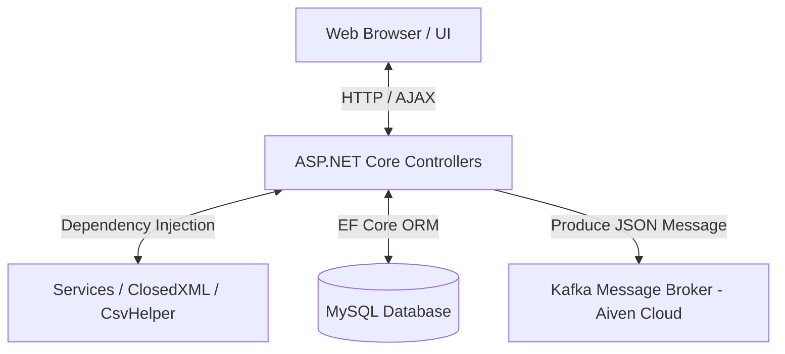
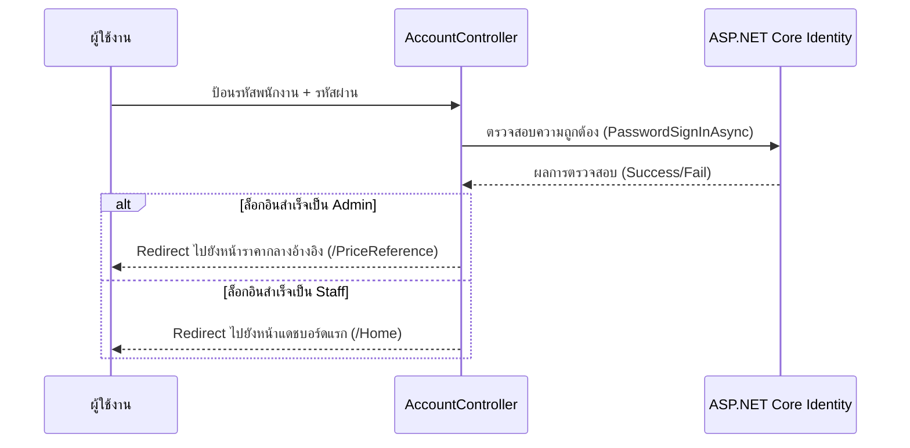
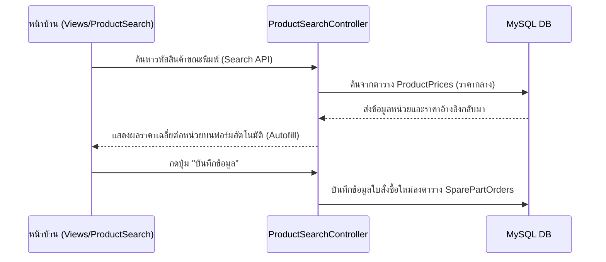

# เอกสารทางเทคนิคและการทำงานของระบบ CostFlow (Developer & Architecture Guide)

เอกสารฉบับนี้จัดทำขึ้นโดยทีมพัฒนา (Dev Team) เพื่อใช้อธิบายโครงสร้างซอฟต์แวร์, สถาปัตยกรรมระบบ, โฟลว์การทำงานของโค้ด (Code Flows), และแนวทางการบำรุงรักษา/พัฒนาต่อยอดระบบ **CostFlow** เพื่อเป็นคู่มือสำหรับพนักงานฝึกงาน, Developer รุ่นใหม่ (Junior Dev) ในการศึกษาทำความเข้าใจ และเพื่ออ้างอิงส่งมอบงานให้ระดับอาวุโส (Senior Dev)

---

## 1. ข้อมูลภาพรวมระบบและเทคโนโลยี (System & Technology Stack)

ระบบ **CostFlow** เป็นเว็บแอปพลิเคชันสำหรับตรวจสอบและเปรียบเทียบข้อมูลราคาจัดซื้ออะไหล่ เครื่องมือ และแผนผลิตชิ้นส่วนภายในโรงงาน ออกแบบบนสถาปัตยกรรม **MVC (Model-View-Controller)** โดยทำงานร่วมกับเครื่องมือจัดการฐานข้อมูลและ Message Queue ภายนอก ดังนี้:



*   **Framework หลัก**: ASP.NET Core 9.0 (MVC)
*   **ระบบสิทธิ์และสมาชิก**: ASP.NET Core Identity (รองรับ Cookie Authentication ระยะเวลา 8 ชั่วโมง)
*   **ฐานข้อมูล (Database)**: MySQL (เชื่อมต่อผ่าน ORM: Entity Framework Core โดยใช้ Pomelo.EntityFrameworkCore.MySql)
*   **ระบบคิวข้อความ (Message Broker)**: Apache Kafka (รันบน Aiven Cloud ผ่านทาง Protocol SASL-SSL ScramSha512)
*   **การประมวลผลไฟล์ Excel/CSV**: ClosedXML (สำหรับเขียน/อ่านข้อมูล Excel) และ CsvHelper (สำหรับประมวลผลไฟล์ CSV)
*   **การจัดระเบียบดีไซน์หน้าบ้าน**: HTML5 / Vanilla JS / CSS ร่วมกับระบบ Tailwind CSS (CDN)

---

## 2. โครงสร้างโฟลเดอร์ของโปรเจกต์ (Project Directory Structure)

โปรเจกต์นี้ได้รับการออกแบบตามแนวทาง Separation of Concerns ของ ASP.NET Core MVC โดยแบ่งโฟลเดอร์หลักออกเป็นดังนี้:

```text
CostFlow/
├── Controllers/            # คลาสควบคุมตรรกะทางธุรกิจหลัก (Business Logic)
├── Models/                 # โมเดลตารางฐานข้อมูล (Entity) และสคีมาข้อมูล
├── ViewModels/             # คลาสสำหรับส่งผ่านข้อมูลเฉพาะทางระหว่าง Controller ไปยังหน้าเว็บ
├── Services/               # คลาสบริการเสริมที่ทำงานแยกย่อย เช่น ตัวดึงข้อมูลหรือจัดรูปแบบไฟล์
├── Views/                  # หน้าตาอินเตอร์เฟสผู้ใช้งาน (Razor Pages - cshtml)
│   ├── Shared/             # หน้าเทมเพลตรวมของเว็บ เช่น _Layout.cshtml และเมนูบาร์
│   ├── Account/            # หน้าสำหรับการลงชื่อเข้าใช้งาน
│   ├── FileMerge/          # หน้าสำหรับการอัปโหลดและประมวลผลรวมไฟล์
│   ├── ProductSearch/      # หน้าสำหรับการบันทึกและจัดการใบสั่งงานอะไหล่สะสม
│   ├── Report/             # หน้าการแสดงประวัติสรุปข้อมูลเปรียบเทียบ
│   └── PriceReference/     # หน้าจัดเก็บข้อมูลราคากลางอะไหล่อ้างอิง
├── wwwroot/                # ไฟล์สถิติต่างๆ ของเว็บ (Static Files: css, js, images, json)
│   └── data/               # ไฟล์ข้อมูลเริ่มต้น (เช่น price_per_unit.json สำหรับ Seed)
├── appsettings.json        # ไฟล์ตั้งค่าสำหรับทดสอบในเครื่องและการเชื่อมต่อ DB / Kafka
└── Program.cs              # จุดเริ่มต้นการทำงาน (Entry Point) และตัวควบคุม Dependency Injection
```

---

## 3. เจาะลึกกระบวนการทำงานหลัก (Core System Workflows)

### 3.1 ระบบการยืนยันตัวตนและการเข้าถึง (Authentication & Role Authorization Flow)

ระบบใช้ ASP.NET Core Identity สำหรับลงทะเบียน ตรวจสอบรหัสผ่าน และแยกสิทธิ์การเข้าถึงข้อมูลโดยแบ่งเป็น **Admin** และ **Staff** 



*   **สิทธิ์ Admin**: เข้าถึงและจัดการข้อมูลราคากลาง (เพิ่ม, แก้ไข, ลบ) ในระบบได้
*   **สิทธิ์ Staff**: ใช้งานระบบเปรียบเทียบข้อมูลไฟล์, คีย์บันทึกข้อมูลใบสั่งซื้อ, และดูรายงานได้เฉพาะของตนเองเท่านั้น
*   **การปกป้องหลังบ้าน**: การจำกัดสิทธิ์ในระดับ API/Controller จะใช้ Attribute `@if (User.IsInRole("Admin"))` ที่ฝั่งหน้าบ้าน และ `[Authorize(Roles = "Admin")]` บน Controller เมธอดทางฝั่งหลังบ้าน

---

### 3.2 ระบบเปรียบเทียบและประมวลผลไฟล์ (File Merge & Core Logic Flow)

หนึ่งในตรรกะสำคัญของโรงงานคือการตรวจสอบว่าแผนการผลิตรายสัปดาห์ (Weekly Production Plan) และใบขออนุมัติสั่งผลิตชิ้นส่วน (Work Order Request) มีข้อมูลราคารวมและปริมาณจัดซื้อตรงกันหรือไม่

*   **Controller รับผิดชอบ**: [FileMergeController.cs](file:///d:/ProjectIntern/CostFlow/Controllers/FileMergeController.cs)
*   **ขั้นตอนการประมวลผล**:
    1.  พนักงานอัปโหลดไฟล์ Excel 2 ไฟล์ ได้แก่ ไฟล์แหล่งข้อมูลแผนผลิตหลัก และไฟล์ใบขออนุมัติสั่งผลิต
    2.  ระบบใช้ไลบรารี **ClosedXML** อ่านตารางข้อมูล และส่งต่อให้ [ImportDbService.cs](file:///d:/ProjectIntern/CostFlow/Services/ImportDbService.cs) ในการแปลงข้อมูลออกมาเป็นโมเดล C#
    3.  **ขั้นตอนการแมตช์ (Matching Algorithm)**: ระบบจะนำสินค้าที่มีรหัสตรงกัน (ProductCode) มาคำนวณเปรียบเทียบ:
        *   หาค่าส่วนต่างของราคาต่อชิ้น (Price per Unit Difference)
        *   หาค่าส่วนต่างปริมาณการผลิต (Quantity Difference)
    4.  จัดเก็บบันทึกประวัติการเปรียบเทียบลงในตาราง `ImportSessions` และ `SessionDetails` เพื่อนำไปออกรายงานสรุปผลต่าง (Report Summary)

---

### 3.3 ระบบลงบันทึกใบสั่งซื้อและฐานข้อมูลราคากลาง (Purchase Order Entry & Price Check)

เมื่อพนักงานต้องการคีย์งานสั่งซื้ออะไหล่สะสมแบบร่าง (Draft Box) ตัวเว็บหน้าบ้านจะเปิดฟอร์มคีย์ข้อมูลที่ส่งคำสั่งค้นหาอัตโนมัติด้วยเทคนิค **AJAX (Asynchronous JavaScript and XML)** 



---

### 3.4 ระบบส่งข้อความผ่านทางคิวข้อความ (Apache Kafka Producer Integration)

เพื่อรองรับการขยายตัวในองค์กร หรือการส่งต่อไปยังระบบสถิติส่วนกลางของโรงงาน เมื่อพนักงานกดยืนยันการคีย์งานหรือทำรายงาน ระบบจะส่งสำเนาข้อมูลสรุปไปที่ **Kafka Event Broker** 

*   **การตั้งค่าคอนฟิก**: ดึงการเชื่อมต่อ SASL (ScramSha512) จาก `KafkaConfig` ใน `appsettings.json`
*   **ตรรกะการรันคำสั่ง (Code Implementation)**: 
    ใน `Program.cs` ได้ลงทะเบียนใช้งาน `IProducer<Null, string>` ไว้ในระบบ Dependency Injection แบบ Singleton:
    ```csharp
    builder.Services.AddSingleton<IProducer<Null, string>>(sp => 
        new ProducerBuilder<Null, string>(producerConfig).Build());
    ```
    เมื่อ Controller หลักทำรายการสำเร็จ จะทำการ Inject `IProducer<Null, string>` เข้าไปทาง Constructor จากนั้นแปลงข้อมูลเป็น JSON String และส่งคำสั่งออกไปด้วยเมธอด `producer.ProduceAsync("topic_name", new Message<Null, string> { Value = jsonString })`

---

## 4. โครงสร้างตารางฐานข้อมูลและส่วนเชื่อมโยง (Database Schema & EF Core Context)

ฐานข้อมูลทำงานอยู่บน MySQL ประกอบด้วย 6 ตารางหลักที่สร้างผ่าน Entity Framework Core Context:

1.  **AspNetUsers**: ตารางข้อมูลผู้ใช้งานและผู้ดูแลระบบหลัก (ขยายฟิลด์ผ่านคลาส `ApplicationUser` เพื่อจัดเก็บ `FullName` และ `ProfilePictureUrl`)
2.  **AspNetRoles / AspNetUserRoles**: ตารางควบคุมสิทธิ์สมาชิกกลุ่ม (Admin, Staff)
3.  **ProductPrices**: ตารางราคากลางอ้างอิงของอะไหล่ รวมถึงหน่วยนับ ราคาเฉลี่ย แหล่งข้อมูลในอดีต (ใช้รหัสสินค้า `ProductCode` เป็น Primary Key ตัวอักษร)
4.  **SparePartOrderBatches**: ตารางเก็บกลุ่มก้อนใบสั่งซื้อประจำวัน (Batch)
5.  **SparePartOrders**: ตารางเก็บรายการสั่งซื้ออะไหล่รายตัว ที่ผูกโยงกับ Batch (`BatchId`)
6.  **ImportSessions / SessionDetails**: ตารางเก็บแฟ้มประวัติรายงาน และผลลัพธ์การแมตช์จับคู่ไฟล์ที่ประมวลผลเสร็จสิ้น

---

## 5. คู่มือสำหรับนักพัฒนา: ขั้นตอนการเพิ่มฟีเจอร์หรือแก้ไขระบบ (How-to Guide)

### 📌 หากต้องการแก้ไขโครงสร้างคอลัมน์ในตารางฐานข้อมูล (Schema Change)
1.  ทำการเพิ่มหรือลดฟิลด์ที่ต้องการในไฟล์โฟลเดอร์ `Models/` (เช่นไฟล์ `ProductPrice.cs` หรือ `SparePartOrder.cs`)
2.  เนื่องจากระบบตั้งค่ารันตรรกะ `db.Database.EnsureCreated();` ที่ `Program.cs` บรรทัดที่ 105 ในกรณีที่ฐานข้อมูลยังไม่เคยถูกสร้าง
3.  หากเป็นฐานข้อมูลรันงานปัจจุบัน (Production) ที่มีตารางอยู่แล้ว วิธีแก้ไขที่เร็วที่สุดคือเขียนคำสั่ง ALTER TABLE ผ่าน SQL ดิบแบบปลอดภัยในบล็อค Try-Catch ดังนี้:
    ```csharp
    try
    {
        db.Database.ExecuteSqlRaw("ALTER TABLE ชื่อตาราง ADD COLUMN ชื่อคอลัมน์ ชนิดข้อมูล NULL;");
    }
    catch { /* กรณีคอลัมน์ถูกสร้างไปแล้ว ป้องกันระบบเด้งเออร์เรอร์ */ }
    ```

### 📌 หากต้องการเพิ่มหน้าเว็บ (View) และ Controller ใหม่เข้ามาในโปรเจกต์
1.  สร้างไฟล์ Controller ใหม่ในโฟลเดอร์ `Controllers/` ลงท้ายนามสกุลคลาสด้วย `Controller` เช่น `DashboardController.cs` และสืบทอดมาจากคลาส `Controller`
2.  เขียน Action Method เช่น `public IActionResult Summary()`
3.  สร้างโฟลเดอร์ย่อยใน `Views/` ให้ตรงกับชื่อของ Controller (เช่น `Views/Dashboard/`)
4.  สร้างไฟล์ Razor View `.cshtml` ให้ชื่อตรงกับ Action Method (เช่น `Summary.cshtml`)
5.  ไปที่ไฟล์ [Views/Shared/_Layout.cshtml](file:///d:/ProjectIntern/CostFlow/Views/Shared/_Layout.cshtml) เพื่อทำลิงก์แท็บเมนูบาร์ด้านซ้าย โดยเพิ่มแท็ก `<a>` ที่ตกแต่งด้วย Tailwind CSS

---

เอกสารนี้ครอบคลุมโครงสร้างและการทำงานในระดับมาตรฐานสากลของโปรเจกต์ CostFlow หวังว่าคู่มือฉบับนี้จะช่วยเพิ่มความเร็วในการพัฒนางานและเป็นระบบอ้างอิงที่ดีต่อการทำงานของทีม Dev ต่อไปครับ
