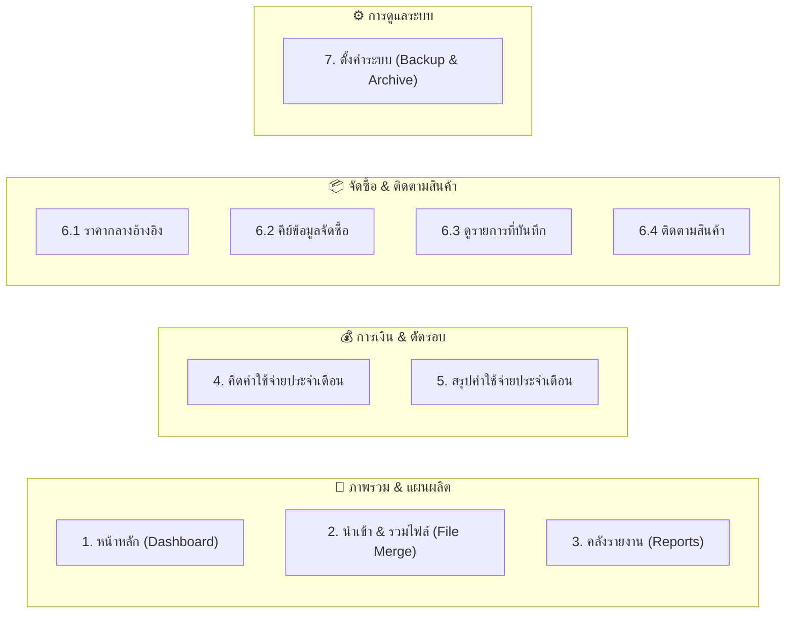

# 📖 คู่มือการใช้งานระบบ CostFlow (Complete Menu & Features Manual)

> **CostFlow** คือระบบบริหารจัดการ เปรียบเทียบข้อมูล และวิเคราะห์ต้นทุนการสั่งผลิตชิ้นส่วนอะไหล่โรงงานอย่างครบวงจร เชื่อมโยงข้อมูลแผนการผลิตประจำสัปดาห์ ใบขออนุมัติสั่งผลิต ฐานข้อมูลราคากลางมาตรฐาน และระบบติดตามการรับของหน้างาน

---

## 👥 บทบาทผู้ใช้งานและสิทธิ์ในระบบ (User Roles & Access)

| บทบาท (Role) | รหัสบัญชีตัวอย่าง | ขอบเขตการเข้าถึงและหน้าที่ |
| :--- | :--- | :--- |
| 🛡️ **ผู้ดูแลระบบ (Admin)** | `ADMIN01` | มีสิทธิ์เข้าถึงและจัดการได้ทุกเมนู: ดูแดชบอร์ด, นำเข้าและรวมไฟล์, คลังรายงาน, คิดค่าใช้จ่ายรายเดือน, จัดการราคากลาง, จัดการระบบจัดซื้อ และตั้งค่าสำรองฐานข้อมูล |
| 💻 **ทีมพัฒนา (Dev / Testing)** | `DEV01` | มีสิทธิ์เทียบเท่า Admin ทุกประการ พร้อมมีแถบเครื่องมือ **Draggable Dev Panel** สำหรับเลื่อนเวลาทดสอบ (`+1 เดือน`, `-1 เดือน`, จำลอง Auto-Skip) |
| 🔧 **เจ้าหน้าที่ฝ่ายช่าง (Staff)** | `STAFF01` | เข้าถึงเฉพาะส่วนงานจัดซื้อหน้างาน: คีย์ใบสั่งซื้ออะไหล่ (`/ProductSearch`), ดูรายการที่บันทึกไว้ (`/ProductSearch/SavedOrders`), และติดตามสินค้า (`/OrderTracking`) |

---

## 🧭 รายละเอียดการใช้งานแต่ละเมนู (Menu Breakdown)

---

### 1️⃣ หน้าหลัก (Dashboard — `/Home/Index`)
* **วัตถุประสงค์:** ศูนย์รวมสถิติภาพรวมสถานะต้นทุนและกิจกรรมสำคัญของระบบ
* **ส่วนประกอบหลัก:**
  1. **ป้ายต้อนรับ (Hero Banner):** แสดงสถานะระบบพร้อมสัญญาณไฟ Real-time Polling
  2. **สถิติสำคัญ 4 การ์ด (Quick Metric Cards):**
     - **รายงานที่บันทึก:** จำนวนไฟล์รายงานการสั่งผลิตที่ประมวลผลสะสมในระบบ
     - **ค่าใช้จ่ายประจำปี:** ยอดรวมต้นทุนจริงของปีปัจจุบัน (พ.ศ.)
     - **รายการสั่งซื้อสะสม:** จำนวนรายการอะไหล่ที่บันทึกผ่านระบบจัดซื้อ
     - **ราคากลางอ้างอิง:** จำนวนสินค้าในฐานข้อมูลราคากลางมาตรฐาน
  3. **เมนูเข้าใช้งานด่วน (Quick Navigation Cards):** ทางลัดเข้าสู่ 4 ฟังก์ชันหลัก
  4. **รายงานล่าสุด (Recent Reports Stream):** แสดงประวัติรายงาน 5 รายการล่าสุด พร้อมเปอร์เซ็นต์ความตรงตามแผน (`% Matched`) และชื่อผู้นำเข้า โดยอัปเดตข้อมูลอัตโนมัติทุก 15 วินาที

---

### 2️⃣ นำเข้า & รวมไฟล์ (File Merge — `/FileMerge/Index`)
* **วัตถุประสงค์:** เครื่องมือเปรียบเทียบข้อมูลระหว่าง **"ใบสั่งงานผลิตหลัก (Master PO / WO File)"** กับ **"แผนผลิตประจำสัปดาห์ (Weekly Plan File)"** เพื่อตรวจสอบความถูกต้องของต้นทุน
* **ขั้นตอนการทำงาน:**
  1. **Step 1: อัปโหลดและเลือก Sheet:** อัปโหลดไฟล์ Excel/CSV ของทั้ง 2 ไฟล์ เลือกระบุชีทที่ต้องการประมวลผล
  2. **Step 2: เลือกและจับคู่ Column:** ระบุคอลัมน์สำคัญ เช่น เลขที่ใบสั่งผลิต, รหัสสินค้า, จำนวน, ราคาต่อหน่วย, มูลค่ารวม, วันที่อนุมัติ
  3. **Step 3: เปรียบเทียบและวิเคราะห์ผลต่าง:**
     - **ตรงตามแผน (Matched):** รายการที่มีอยู่ในแผนผลิตและตรงกับใบสั่งผลิต
     - **ไม่ตรงตามแผน / ผลต่าง (Deviation):** รายการที่มีความต่างเรื่องจำนวนหรือราคา
     - **รายการที่ไม่มีในแผน (Unplanned / Extra):** รายการสั่งผลิตที่อยู่นอกแผนงาน
  4. **Step 4: บันทึกเข้าระบบ:** กดบันทึกเพื่อจัดเก็บรายงานเข้าสู่ตาราง `Reports` และ `OrderTrackingMasters`

---

### 3️⃣ รายงานและคลังข้อมูล (Reports — `/Report`)
* **วัตถุประสงค์:** คลังจัดเก็บประวัติรายงานการเปรียบเทียบข้อมูลย้อนหลัง และตรวจสอบรายละเอียดเชิงลึก
* **หน้ารายการรายงาน (`/Report/Index`):**
  - กรองดูรายงานตามปี (พ.ศ.)
  - แสดงชื่อไฟล์, วันที่สร้าง, จำนวนรายการ, ยอดรวมเงิน, และระดับความตรงตามแผน
* **หน้ารายละเอียดรายงาน (`/Report/Details?fileName=...`):**
  - แสดงตารางแจกแจงรายการอะไหล่ทุกบรรทัด พร้อมไฮไลท์สถานะ (ตรงแผน / นอกแผน)
  - มีปุ่ม **Export to Excel (`.xlsx`)** เพื่อดาวน์โหลดรายงานไปใช้งานต่อภายนอก
* **หน้ารวมรายการสั่งซื้อทั้งหมด (`/Report/AllOrders`):**
  - แสดงรายการสั่งผลิตทั้งหมดในระบบ สามารถค้นหาด้วยรหัสสินค้า, เลขที่ PO, หรือชื่ออะไหล่

---

### 4️⃣ คิดค่าใช้จ่ายประจำเดือน (Monthly Cost — `/MonthlyCost/Index`)
* **วัตถุประสงค์:** จัดการและคำนวณต้นทุนการผลิตจริงประจำแต่ละเดือน (มกราคม - ธันวาคม)
* **หน้าแสดงการ์ด 12 เดือน (`/MonthlyCost/Index`):**
  - แสดงการ์ดประจำเดือนทั้ง 12 เดือนของปีที่เลือก
  - แสดงสถานะรอบเดือน: **กำลังดำเนินการ (Current Month)**, **ปิดยอดแล้ว (Closed)**, หรือ **ยังไม่ถึงรอบ (Upcoming)**
  - แสดงยอดรวมต้นทุนจริงและจำนวนรายการที่ส่งมอบแล้ว
* **หน้ารายละเอียดรอบเดือน (`/MonthlyCost/Detail/{ชื่อเดือน}`):**
  - **ตารางสรุปงบประมาณและยอดตัดจ่าย:** แสดงยอดตั้งต้น, ยอดรับของจริง, และยอดยกยอดมา
  - **รายการรอส่งมอบ (Pending Orders):** รายการที่มีกำหนดส่งมอบในเดือนนี้แต่ยังไม่ได้รับของ
  - **ปุ่มผลัดยอด (Defer / Forward):** เลื่อนรายการที่ยังไม่ได้รับของไปรับในเดือนถัดไป
  - **รายการรับมอบแล้ว (Received Orders):** รายการที่ตรวจรับของสำเร็จและนำมาคิดเป็นต้นทุนของเดือนนี้เรียบร้อยแล้ว

---

### 5️⃣ สรุปค่าใช้จ่ายประจำเดือน (Monthly Cost Summary — `/MonthlyCost/Summary`)
* **วัตถุประสงค์:** ตารางสรุปเปรียบเทียบตัวเลขทางการเงินและผลการดำเนินงานตลอดทั้งปี
* **ตารางสรุป 12 เดือน:**
  - **เดือน:** มกราคม ถึง ธันวาคม
  - **จำนวนรายการที่รับของ:** จำนวนสินค้าที่ตรวจรับสำเร็จในแต่ละเดือน
  - **ยอดรับของจริง (Actual Received Amount):** มูลค่าสินค้าที่รับมอบจริงในเดือนนั้น
  - **ยอดยกยอดมา (Carry-over Amount):** มูลค่าสินค้าที่ผลัดมาจากเดือนก่อนหน้า
  - **ยอดรวมทั้งสิ้น (Total Monthly Cost):** ผลรวมต้นทุนทั้งหมดของเดือน
  - **แถวรวมสุทธิประจำปี (Grand Total):** รวมตัวเลขทั้ง 12 เดือนของทั้งปี

---

### 6️⃣ ระบบจัดซื้อและติดตามสินค้า (Purchase & Tracking Tools)

#### 6.1 ราคากลางอ้างอิง (`/PriceReference/Index`)
* ฐานข้อมูลราคากลางอะไหล่มาตรฐานของโรงงาน
* ระบบค้นหาอัจฉริยะ (Instant AJAX Search) ค้นหาจากรหัสสินค้าหรือชื่ออะไหล่
* ฟังก์ชันเพิ่ม, แก้ไข, ลบรายการสินค้า และการ Import ไฟล์ราคากลางจาก Excel/CSV

#### 6.2 คีย์ข้อมูลจัดซื้อหน้างาน (`/ProductSearch/Index`)
* ออกแบบมาสำหรับเจ้าหน้าที่ฝ่ายช่าง (Staff) หรือฝ่ายจัดซื้อในการคีย์รายการอะไหล่ที่ต้องการสั่งซื้อ
* เมื่อพิมพ์ชื่อหรือรหัสสินค้า ระบบจะดึงราคากลางมาตรฐานมาให้อัตโนมัติ
* สามารถระบุจำนวน, ราคาที่สั่งซื้อจริง, หมายเหตุ และรวมยอดเงินแบบเรียลไทม์
* กด **"บันทึกชุดสั่งซื้อเข้าสู่ระบบ"** เพื่อสร้างเป็นแผ่นงาน (Batch)

#### 6.3 ดูรายการที่บันทึก (`/ProductSearch/SavedOrders`)
* แสดงประวัติชุดแผ่นงานการสั่งซื้ออะไหล่ทั้งหมด
* สามารถเลือกกรองตามเดือน, ปี, หรือเลือกดูเฉพาะแผ่นงานที่สนใจ
* สามารถแก้ไขจำนวนสินค้าในแต่ละรายการ หรือลบแผ่นงานที่ไม่ต้องการได้
* รองรับการ Migrate ข้อมูลจาก SQLite เข้าสู่ฐานข้อมูลหลัก TiDB Cloud

#### 6.4 ติดตามสถานะสินค้า (`/OrderTracking/Index` & `/OrderTracking/Detail`)
* ติดตามสถานะการส่งมอบและการตรวจรับของแต่ละแผ่นงาน
* **สถานะการรับของ:**
  - 🟡 **รอรับสินค้า:** ยังไม่มีรายการใดตรวจรับ
  - 🔵 **รับแล้วบางส่วน (x/y รายการ):** รับมอบของแล้วบางส่วน
  - 🟢 **รับสินค้าครบแล้ว:** ได้รับของครบถ้วนตามใบสั่งซื้อ
* ในหน้า Detail มี Checkbox สำหรับเลือกรายการที่ได้รับของ พร้อมเปิดปฏิทินระบุวันที่ตรวจรับจริง

---

### 7️⃣ ตั้งค่าระบบและการสำรองข้อมูล (Settings — `/Home/Settings`)
* **วัตถุประสงค์:** บริหารจัดการฐานข้อมูล สำรองไฟล์ และบำรุงรักษาความปลอดภัยของระบบ
* **ฟังก์ชันหลัก:**
  1. **สำรองข้อมูลทั้งหมด (Full Backup .ZIP):**
     - บีบอัดฐานข้อมูลระบบเป็นไฟล์ ZIP เดียว ประกอบด้วย:
       - `TiDB_CostFlowCore_*.json`: ตารางหลัก (Orders, Reports, WeeklyPlans, ProductPrices, WeeklyPlanDetails, MonthlyOrderActions) โดยใช้ UTF-8 Thai Encoding อ่านภาษาไทยได้ทันที
       - `TiDB_SavedOrders_*.json`: ตารางสั่งซื้ออะไหล่หน้างาน (SavedOrderBatches, SavedOrderItems)
  2. **ล้างข้อมูลย้อนหลัง 2 ปี (Archive & Purge):**
     - ตรวจสอบรายการที่มีอายุเกิน 2 ปี
     - หากมีข้อมูลเก่า: ระบบจะทำการส่งออกเป็นไฟล์ `PurgedArchive.json` ให้ดาวน์โหลดลงเครื่องก่อน จากนั้นจึงลบออกจากฐานข้อมูลเพื่อเพิ่มความเร็วให้ระบบ
     - หากไม่มีข้อมูลเก่าเกิน 2 ปี: ระบบจะแจ้งเตือนอย่างชัดเจนว่าฐานข้อมูลอยู่ในสถานะสมบูรณ์
  3. **ฐานข้อมูลสำรอง Google Sheets:**
     - ลิงก์ตรงไปยัง Google Sheets กลางขององค์กร (`gid=572126532`) สำหรับตรวจสอบข้อมูลที่ถูก Sync ออกไป
