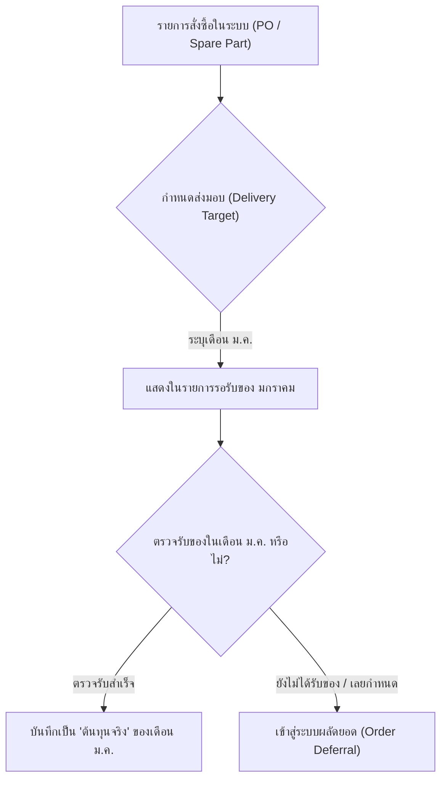
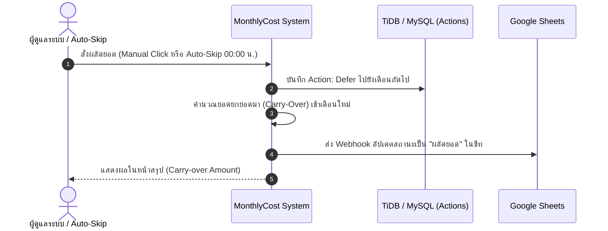
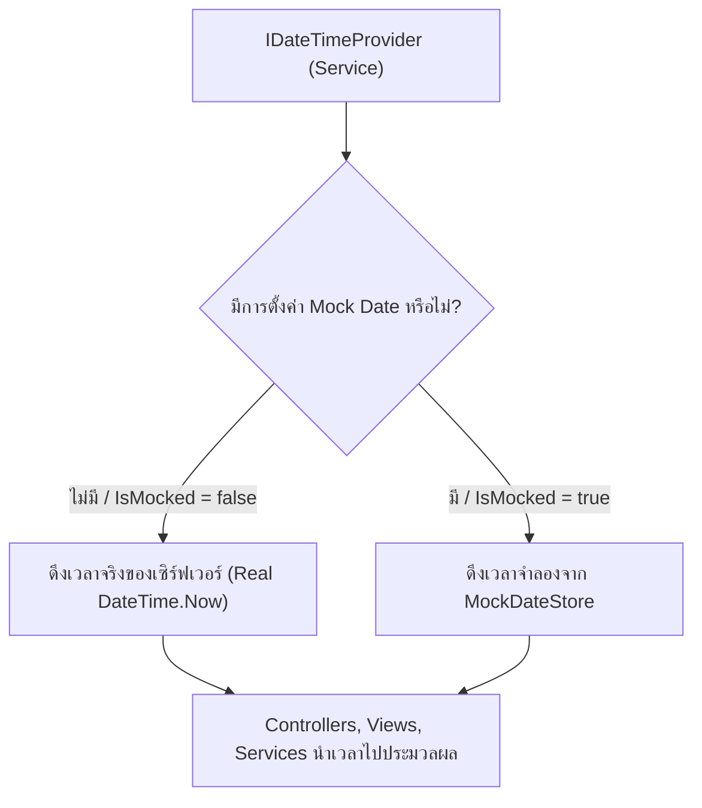
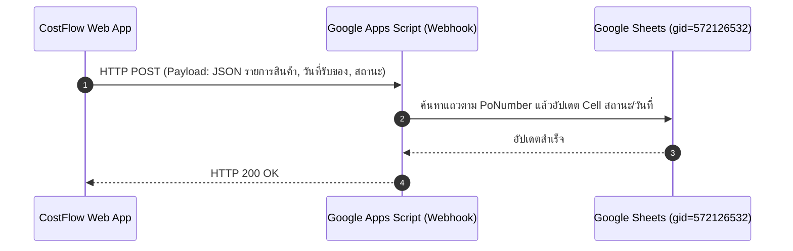

# ⚙️ คู่มือเจาะลึก: ระบบตรวจรับของ การผลัดยอด และการจัดการเวลา
> **CostFlow Engine Deep-Dive:** อธิบายกลไกการทำงานของระบบการรับสินค้า, ระบบผลัดยอดรอบเดือน (Carry-over / Auto-Skip), สถาปัตยกรรมการจำลองเวลา (Mock Date Time Engine) และการซิงค์ข้อมูลกับ Google Sheets

---

## 📦 1. ระบบการตรวจรับของ (Goods Receipt System)

### 1.1 ที่มาของข้อมูลและรอบเดือน
รายการสินค้าที่ต้องตรวจรับในระบบมาจาก 2 แหล่งข้อมูลหลัก:
1. **รายการสั่งผลิตจากไฟล์ Master (`OrderTrackingMasters`):** มีกำหนดส่งมอบระบุไว้ในคอลัมน์ `DeliveryTarget` หรือคำนวณจากวันที่อนุมัติสั่งผลิต (`ApprovedDate`)
2. **รายการสั่งซื้ออะไหล่หน้างาน (`SavedOrderItems`):** บันทึกจากระบบจัดซื้อหน้างานพร้อมระบุวันที่รับสินค้า



### 1.2 กระบวนการตรวจรับของ (Receipt Workflow)
1. ผู้ใช้งานเข้าไปที่หน้า **คิดค่าใช้จ่ายประจำเดือน** (`/MonthlyCost/Detail/{เดือน}`) หรือหน้า **ติดตามสินค้า** (`/OrderTracking/Detail`)
2. เลือกรายการสินค้าที่ได้รับของจริง และระบุ **"วันที่รับสินค้า (Received Date)"**
3. ระบบจะทำงานดังนี้:
   - บันทึกประวัติการรับของลงในตาราง `MonthlyOrderActions` (Action: `Received`)
   - นำมูลค่าของรายการนั้นเข้ามารวมเป็น **"ยอดต้นทุนจริง (Actual Received Cost)"** ของเดือนที่รับของ
   - ส่ง Webhook ไปอัปเดตสถานะใน Google Sheets แบบ Real-time

---

## 🔄 2. ระบบการผลัดยอด (Order Deferral & Auto-Skip)

### 2.1 ทำไมต้องมีระบบผลัดยอด?
ในโรงงานอุตสาหกรรม มีหลายกรณีที่ชิ้นส่วนอะไหล่หรือใบสั่งผลิต **ไม่สามารถส่งมอบได้ทันตามกำหนดสิ้นเดือนเดิม** (เช่น ซัพพลายเออร์ส่งล่าช้า, รอประกอบ)  
ระบบ CostFlow จึงออกแบบระบบ **ผลัดยอด (Deferral / Forwarding)** เพื่อให้:
- งบประมาณและยอดเงินไม่สูญหาย
- สามารถตัดยอดและปิดงบเดือนปัจจุบันได้อย่างถูกต้อง
- ยอดที่ยังไม่ได้รับของจะถูกยกไปเป็น **"ยอดยกยอดมา (Carry-over Balance)"** ในเดือนถัดไปอัตโนมัติ



### 2.2 สองรูปแบบการผลัดยอด
ระบบรองรับการผลัดยอด 2 วิธี:

#### 1) การผลัดยอดด้วยตนเอง (Manual Forwarding)
- ผู้ดูแลระบบเข้าไปที่หน้า `/MonthlyCost/Detail/{เดือน}`
- ในส่วน **"รายการรอรับของ (Pending Orders)"** สามารถคลิกปุ่ม **"ผลัดไปเดือนถัดไป (Defer to Next Month)"** ของรายการที่ต้องการได้ทันที
- รายการนั้นจะถูกเปลี่ยนสถานะเป็น `Deferred` และย้ายไปปรากฏในรายการของเดือนถัดไป

#### 2) ระบบผลัดยอดอัตโนมัติ (Auto-Skip Background Service)
- ขับเคลื่อนด้วย `AutoSkipBackgroundService.cs`
- **เวลาทำงานจริง (Production):** รันอัตโนมัติ **ทุกคืนเวลา 00:00 น.**
- **การทำงาน:** สแกนตรวจสอบรายการทั้งหมดที่มีกำหนดส่งมอบในอดีต (เลยกำหนดแล้ว) แต่ยังไม่ได้รับของ (`IsReceived == false`) และทำการผลัดยอดไปยังเดือนปัจจุบันโดยอัตโนมัติ

### 2.3 การบันทึกประวัติการกระทำ (`MonthlyOrderActions`)
ทุกการเปลี่ยนแปลงสถานะจะถูกบันทึกประวัติอย่างเข้มงวดลงในตาราง `MonthlyOrderActions`:
- `PoNumber`: เลขที่ใบสั่งผลิต / รหัสรายการ
- `ActionMonth`: รอบเดือนที่ทำการ
- `ActionType`: ประเภทการกระทำ (`Received`, `Deferred`, `Reset`)
- `ActionDate`: วันที่เวลาที่ทำรายการ
- `CreatedBy`: ผู้ที่ทำรายการ (`ADMIN01`, `DEV01`, หรือ `System_AutoSkip`)

---

## ⏱️ 3. สถาปัตยกรรมการจัดการเวลาและการจำลองเวลา (Time & Mock Engine)

### 3.1 ทำไมระบบไม่ใช้ `DateTime.Now` ดิบ?
เนื่องจากระบบ CostFlow มีฟังก์ชันที่ขึ้นกับเวลาอย่างมาก เช่น:
- การกำหนดว่าเดือนไหนคือ "เดือนปัจจุบัน"
- การปิดยอดสิ้นเดือน
- การทดสอบการทำงานข้ามปี (เช่น จาก ธันวาคม 2568 ไป มกราคม 2569)
- การทดสอบฟังก์ชัน Auto-Skip ผลัดยอด

หากใช้ `DateTime.Now` ดิบ ทีมงานจะไม่สามารถทดสอบระบบย้อนหลังหรือล่วงหน้าได้เลย CostFlow จึงออกแบบระบบ **Time Abstraction Layer**:

```csharp
public interface IDateTimeProvider
{
    DateTime Now { get; }
    DateTime Today { get; }
    bool IsMocked { get; }
}
```



### 3.2 แผงควบคุมเวลาจำลองสำหรับทดสอบ (Draggable Dev Simulator Panel)
สำหรับบัญชี `DEV01` (หรือ Admin ขณะทดสอบ) จะมีแถบควบคุมสีดำลอยอยู่ที่มุมขวาล่างของหน้าจอ:

| ฟังก์ชันในแผงควบคุม | การทำงาน |
| :--- | :--- |
| ◀️ **ปุ่ม `-1 เดือน`** | เลื่อนเวลาย้อนหลังกลับไป 1 เดือนทันที เพื่อตรวจสอบข้อมูลย้อนหลัง |
| ▶️ **ปุ่ม `+1 เดือน`** | เลื่อนเวลาไปข้างหน้า 1 เดือนทันที เพื่อทดสอบการเปลี่ยนผ่านรอบเดือน |
| 📅 **ปฏิทินเลือกวันที่** | ระบุวันที่และเดือนที่ต้องการจำลองได้อย่างอิสระ |
| 🔄 **ปุ่ม `คืนเวลาจริง`** | ล้างค่าจำลองและกลับมาใช้เวลาจริงของเครื่อง |
| ⚡ **สวิตช์ Auto-Skip Simulation (2 นาที)** | สั่งให้ระบบ Auto-Skip วนลูปทำงานทุก 2 นาทีเพื่อใช้ในการ Demo หรือทดสอบฟังก์ชันผลัดยอดโดยไม่ต้องรอถึงเที่ยงคืน |

---

## 📊 4. การเชื่อมต่อและซิงค์ข้อมูลกับ Google Sheets

### 4.1 สถาปัตยกรรม Webhook Sync
ระบบเชื่อมต่อกับ Google Sheets กลางผ่าน `MonthlyOrderSyncService.cs` เพื่อให้ผู้บริหารและฝ่ายที่เกี่ยวข้องสามารถดูรายงานแบบ Real-time บน Google Sheets ได้โดยไม่ต้องเข้าสู่ระบบเว็บแอป



### 4.2 ข้อมูลที่ถูกส่งไปซิงค์
- **เลขที่ใบสั่งซื้อ / รหัสสินค้า (PO Number / Product Code)**
- **ชื่อรายการและรายละเอียดชิ้นส่วน**
- **จำนวนและมูลค่าเงิน**
- **สถานะการส่งมอบ:** `รับของแล้ว`, `รอรับของ`, `ผลัดยอด`
- **วันที่รับมอบจริง (Received Date)**
- **รอบเดือนที่ตัดจ่ายต้นทุน**

🔗 **ลิงก์ชีทปลายทาง:** [Google Sheets กลาง (CostFlow Master Sheet)](https://docs.google.com/spreadsheets/d/1RFXMLRLjidiH6z9C6-DFHZcf8pP_K4TskJJcMVzPS5w/edit?gid=572126532#gid=572126532)
