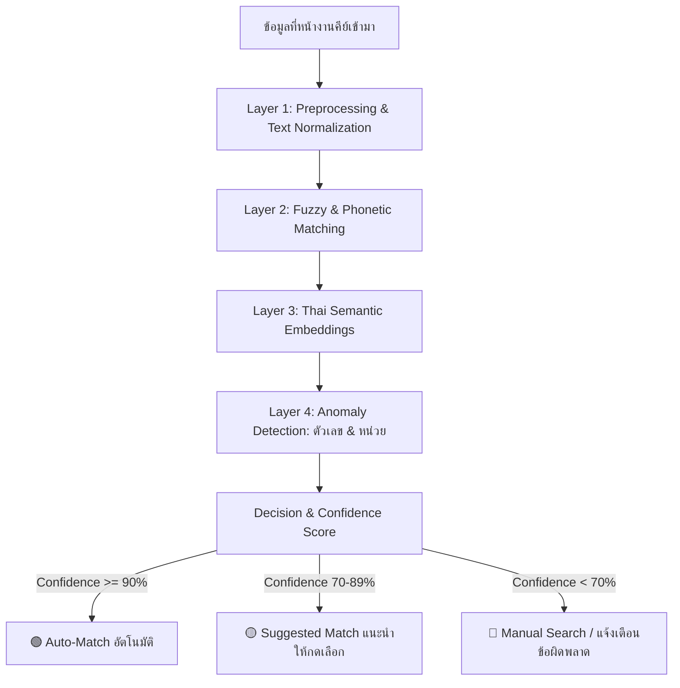

# 💡 แนวคิดและสถาปัตยกรรมการแก้ปัญหาการรับสินค้าเข้าสต๊อกด้วย AI & Thai NLP
*(Concept Proposal: Smart Stock Reconciliation & Typo Matching System)*

---

## 📌 1. ที่มาและปัญหาหน้างานจริง (Problem Statement)

ปัจจุบันกระบวนการสั่งซื้อและรับสินค้ามี 2 ส่วนหลักที่ต้องทำงานสอดคล้องกัน:
1. **ระบบ CostFlow (ระบบจัดการใบสั่งผลิต/สั่งซื้อ - PO/WO):** มีรายการชื่อสินค้า สเปก จำนวน และราคาที่ถูกต้องตามเอกสารอนุมัติ (เช่น *"เพลา 29 นิ้ว"*, *"เฟืองท้าย 5 ตัว"*)
2. **ระบบหน้างาน (Google Web App / Script สต๊อกหน้างาน):** เจ้าหน้าที่หน้างานเป็นผู้ตรวจรับและคีย์บันทึกว่าได้รับของอะไรบ้าง เข้าสต๊อกตำแหน่งไหน

### ⚠️ ปัญหาที่พบ (Pain Points)
* **การพิมพ์ผิดจากความเคยชิน / แป้นพิมพ์ (Typo / Keying Errors):**
  * สลับแป้นพิมพ์หรือตัวอักษรใกล้เคียง เช่น `เฟือวท้าย` แทนที่จะเป็น `เฟืองท้าย` (แป้น ว อยู่ใกล้ ง)
  * พิมพ์ตัวเลขผิดพลาด เช่น ใน PO คือ `เพลา 29 นิ้ว` แต่หน้างานคีย์ `เพลา 129 นิ้ว`
* **การใช้คำย่อและคำพ้องความหมาย (Synonyms & Variations):**
  * เช่น `น็อต` vs `นอต` vs `สกรู` vs `Bolt`
  * การเว้นวรรคและหน่วยนับ เช่น `29 นิ้ว` vs `29"` vs `29in` หรือ `5 ตัว` vs `5 ชิ้น` vs `5 อัน`
* **ภาระในการตรวจทาน (Manual Reconciliation Overhead):**
  * เจ้าหน้าที่ต้องมานั่งกวาดสายตาเทียบเองทีละรายการ ทำให้เสียเวลาและอาจหลุด QC

---

## 🔬 2. การวิเคราะห์โมเดลและเทคโนโลยีที่เหมาะสม (Model & Tech Stack Analysis)

### 2.1 ทำไม `thai2fit` อาจจะไม่ใช่คำตอบที่ดีที่สุดในปัจจุบัน?
* **thai2fit (ULMFiT Thai)** เป็นโมเดลบุกเบิกของภาษาไทยในปี 2018-2019 โดย PyThaiNLP ซึ่งใช้สถาปัตยกรรม AWD-LSTM (RNN ยุคเก่า)
* **ข้อจำกัด:** ตัวโมเดลเน้นงาน Text Classification ระดับประโยค/ย่อหน้า มากกว่าการจับคู่คำเฉพาะทางเทคนิค (Technical Term Matching) และปัจจุบันการดูแลรักษา (Maintenance) ลดลงไปมาก

---

### 2.2 โมเดลและเทคนิคที่แนะนำในปัจจุบัน (Modern Alternatives)

---

### 2.3 รายละเอียดแต่ละระดับของระบบ Matching Engine

#### 🟢 ระดับที่ 1: Text Normalization & Fuzzy Matching (เร็วและเบาที่สุด - ทำใน .NET ได้ทันที)
* **การตัดคำภาษาไทย (Thai Word Segmentation):** ใช้อัลกอริทึม Maximum Collocation หรือพจนานุกรมศัพท์เฉพาะทางช่าง
* **การปรับมาตรฐานหน่วยและสัญลักษณ์ (Rule-based Normalization):**
  * แปลง `"` / `นิ้ว` / `inch` ➔ ให้เป็นมาตรฐานเดียวกัน `[INCH]`
  * แปลง `มม.` / `mm` / `มิลลิเมตร` ➔ `[MM]`
  * ตัดช่องว่างซ้ำและลบวรรณยุกต์เบิ้ล
* **Fuzzy String Matching (Levenshtein / Jaro-Winkler):**
  * ดักจับคำพิมพ์ผิดแป้นใกล้เคียง เช่น `เฟือวท้าย` vs `เฟืองท้าย` (Similarity Score จะสูงถึง 92%)
  * ไลบรารีที่รองรับใน C# .NET: `FuzzySharp`, `SimMetricsCore`

#### 🔵 ระดับที่ 2: Thai Pretrained Transformer & Semantic Embeddings (เข้าใจความหมาย)
* **WangchanBERTa (VISTEC):**
  * โมเดลภาษาไทย Transformer ที่เทรนด้วยคลังข้อความภาษาไทยขนาดใหญ่ มีความแม่นยำสูงมากในการเข้าใจบริบทคำศัพท์ไทย
* **Multilingual Sentence Transformers (เช่น `paraphrase-multilingual-MiniLM-L12-v2` หรือ `BGE-M3`):**
  * แปลงชื่อสินค้าใน PO และชื่อที่หน้างานคีย์ให้กลายเป็น Vector (ตัวเลขชุด 384-768 มิติ)
  * ใช้ **Cosine Similarity** เทียบหาคู่ที่ใกล้เคียงที่สุด แม้ใช้คำคนละคำกัน เช่น `"ลูกปืนตลับ"` กับ `"Bearing"` หรือ `"สายพานร่องวี"` กับ `"V-Belt"`

#### 🟣 ระดับที่ 3: Numeric & Dimension Anomaly Detector (ดักจับตัวเลขและสเปกผิดพลาด)
* จุดสำคัญมากตามที่พี่แจ้ง: **"เพลา 29 นิ้ว" แต่หน้างานพิมพ์ "เพลา 129 นิ้ว"**
* **เทคนิคแก้ปัญหา:** ทำ **Regex Entity Extractor** ดึงตัวเลขและหน่วยออกมาเทียบต่างหาก:
  * ถ้า *ชื่อสินค้าตรงกัน* (เพลา = เพลา) แต่ *ตัวเลขต่างกัน* (29 ≠ 129)
  * ระบบจะไม่จับคู่เงียบๆ แต่จะติดธงส้มแจ้งเตือนทันที:
    > ⚠️ **แจ้งเตือนตัวเลขสเปกไม่ตรง:** PO ระบุ `29 นิ้ว` แต่หน้างานบันทึก `129 นิ้ว` (ต้องการยืนยันหรือไม่?)

---

## 🎨 3. แนวทางการออกแบบหน้าจอและประสบการณ์ผู้ใช้ (UX / UI Human-in-the-Loop)

ระบบที่ดีที่สุดในงานคลังสินค้าไม่ใช่ระบบที่คิดแทน 100% แต่เป็น **"ระบบช่วยคิดและช่วยตรวจทาน (Co-pilot Verification)"**:

| สถานะการตรวจจับ | ความมั่นใจ (Score) | การแสดงผลบน UI | การทำงาน |
| :--- | :---: | :--- | :--- |
| **Match สมบูรณ์** | `95% - 100%` | 🟢 ป้ายเขียว `"จับคู่อัตโนมัติ"` | ติ๊กถูกให้อัตโนมัติ บันทึกเข้าสต๊อกได้ทันที |
| **ตรวจพบคำพิมพ์ผิด / ใกล้เคียง** | `75% - 94%` | 🟡 ป้ายส้ม `"แนะนำ: [ชื่อใน PO]"` | แสดงกล่อง Suggestion ให้ผู้ตรวจกดคลิกเดียวเพื่อแก้งาน |
| **สเปก/ตัวเลขขัดแย้ง** | Any | ⚠️ ป้ายเตือน `"สเปกตัวเลขไม่ตรง"` | ไฮไลต์สีแดงเฉพาะจุดที่ตัวเลขต่างกันชัดเจน |
| **ไม่พบในใบสั่งซื้อ** | `< 70%` | ⚪ ป้ายเทา `"รายการนอกแผน"` | แจ้งเตือนว่าไม่มี PO รองรับ อาจเป็นของแถมหรือสั่งซื้อพิเศษ |

### 🧠 ระบบเรียนรู้คำศัพท์อัตโนมัติ (Self-Learning Synonym Dict)
* เมื่อหน้างานคีย์คำแปลกๆ แล้วผู้ตรวจ **กดยืนยันการจับคู่ (Confirm Match)**
* ระบบจะบันทึกคู่นี้เข้าตาราง `ProductSynonyms` ในฐานข้อมูล
* ครั้งถัดไป เมื่อมีคำนี้เข้ามาอีก ระบบจะจับคู่ได้แม่นยำ 100% ทันทีโดยไม่ต้องประมวลผลซ้ำ

---

## 🏗️ 4. สถาปัตยกรรมทางเทคนิคที่แนะนำ (Technical Architecture Options)

### 🌟 ตัวเลือกที่ 1: C# Native Hybrid Matching (แนะนำสำหรับเริ่มแรก - ง่าย ไม่เปลือง Server)
* **เทคโนโลยี:** C# .NET 9 + `FuzzySharp` + `Regex Entity Extraction` + `SQLite/MySQL Synonym Table`
* **ข้อดี:** 
  * ทำงานภายในโปรเจกต์ `CostFlow` ได้โดยตรง 100%
  * ไม่ต้องติดตั้ง Python Environment หรือ Server เพิ่ม
  * ความเร็วในการประมวลผลระดับ Millisecond (เสี้ยววินาที)
* **ความสามารถ:** จัดการคำพิมพ์ผิด (Typo), สลับแป้นพิมพ์, ตรวจจับตัวเลขสเปกผิดพลาด และบันทึก Synonym สะสมได้สบายๆ

### 🌟 ตัวเลือกที่ 2: Python AI Microservice (สำหรับขยายสเกลความฉลาด)
* **เทคโนโลยี:** FastAPI + PyThaiNLP + WangchanBERTa / SentenceTransformers
* **ข้อดี:** รองรับ Semantic Search ลึกซึ้ง เข้าใจคำพ้องความหมายซับซ้อน
* **การเชื่อมต่อ:** ระบบ CostFlow หรือ Google Script ส่งชื่อสินค้าผ่าน REST API ➔ Microservice ตอบกลับมาเป็นรายการคู่ที่น่าจะเป็นพร้อม % Confidence

### 🌟 ตัวเลือกที่ 3: Lightweight LLM API Assistant (สำหรับอัจฉริยะแบบไร้รอยต่อ)
* **เทคโนโลยี:** เรียก Gemini Flash API หรือ Local Ollama
* **การทำงาน:** ส่งรายการ PO และรายการที่หน้างานคีย์ให้ LLM ตรวจเปรียบเทียบและคืนค่า JSON สรุปจุดที่ผิดพลาดพร้อมข้อเสนอแนะ

---

## 📋 5. สรุป Checklist สิ่งที่ควรเตรียมเมื่อพร้อมเริ่มพัฒนา

- [ ] จัดทำตารางพจนานุกรมชื่อสินค้ามาตรฐาน (Master Item Catalog & Aliases)
- [ ] กำหนดโครงสร้างข้อมูลส่งผ่านระหว่าง Google Apps Script กับ CostFlow
- [ ] ทดสอบความแม่นยำของ Fuzzy String Matching บนรายการตัวอย่างจริง 50-100 รายการ
- [ ] ออกแบบหน้าจอ UI สำหรับหน้างานและผู้ตรวจสอบเพื่อกดยืนยัน/แก้ไขความถูกต้อง (Reconciliation Dashboard)
