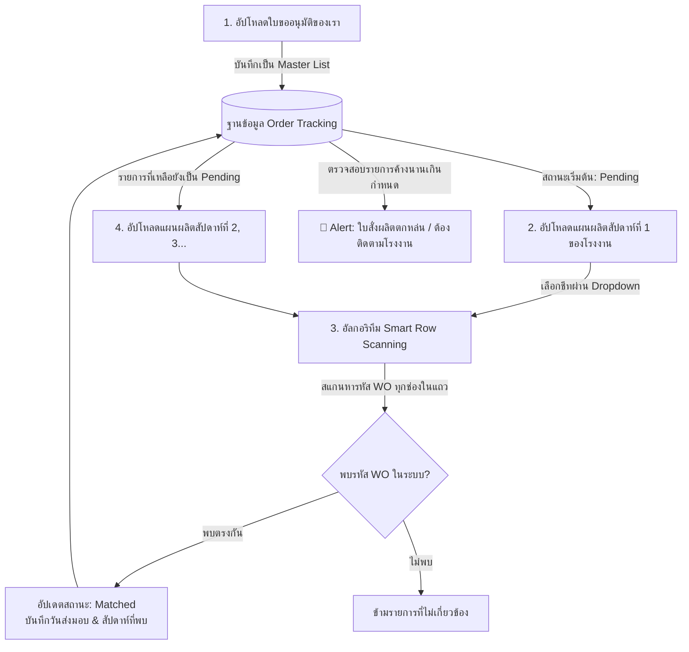

# การวิเคราะห์ปัญหาและแนวทางปรับโครงสร้างระบบ File Merge (Order Tracking Engine)

เอกสารฉบับนี้จัดทำขึ้นเพื่อวิเคราะห์ปัญหาของระบบเปรียบเทียบไฟล์ Excel (File Merge) ในปัจจุบันของโปรเจค **CostFlow** และนำเสนอแนวทางการปรับโครงสร้าง (Architecture Redesign) เพื่อให้ตอบโจทย์กระบวนการทางธุรกิจจริง (Business Workflow) ในการติดตามใบขออนุมัติสั่งผลิตข้ามสัปดาห์ (One-to-Many), การจัดการไฟล์ที่มีหลายชีท (Multi-Sheet), และการป้องกันข้อผิดพลาดจากโรงงาน (Human Error & Column Shifting) โดยใช้คุณสมบัติและประสิทธิภาพของ **C# (.NET 9)** อย่างเต็มที่

---

## 1. วิเคราะห์ปัญหาในระบบปัจจุบัน (Current Architecture Bottlenecks)

จากการตรวจสอบโค้ดใน [FileMergeController.cs](file:///d:/ProjectIntern/CostFlow/Controllers/FileMergeController.cs) พบข้อจำกัดและปัญหาสำคัญ 3 ประการดังนี้:

### 🚨 ปัญหาที่ 1: การยึดไฟล์ผิดแกนหลัก และข้อจำกัดแบบ One-to-One
* **สิ่งที่ระบบเป็นอยู่:** โค้ดเดิมนำ **"ไฟล์ B (แผนผลิตประจำสัปดาห์จากโรงงาน)"** มาเป็นแกนหลัก (Driver) ในการวนลูป แล้วนำ **"ไฟล์ A (ใบขออนุมัติสั่งผลิตของเรา)"** มาปะติด (Left-Join)
* **ผลกระทบทางธุรกิจ:**
  * ทำให้ระบบมองเห็นเฉพาะรายการที่โรงงานส่งมาในสัปดาห์นั้นๆ แต่ **"มองไม่เห็นรายการของเราที่ตกหล่นหรือยังไม่ได้รับแผนผลิต"**
  * ไม่รองรับความสัมพันธ์แบบ **One-to-Many (1 ใบขออนุมัติ : หลายแผนผลิตรายสัปดาห์)** เมื่อโรงงานส่งแผนผลิตสัปดาห์ที่ 2 หรือ 3 มา ข้อมูลการจับคู่ของสัปดาห์แรกจะสูญหาย (Stateless) ทำให้ไม่สามารถติดตามสถานะงานสะสมได้

### 🚨 ปัญหาที่ 2: การเดาชื่อชีทแบบตายตัว (Hardcoded Sheet Guessing)
* **สิ่งที่ระบบเป็นอยู่:** ระบบค้นหาชีทโดยใช้การเช็คชื่อแบบตายตัว เช่น `mcsAppvProduct` หรือ `รวมงานผลิต` + `ราคา` ([L44](file:///d:/ProjectIntern/CostFlow/Controllers/FileMergeController.cs#L44), [L74](file:///d:/ProjectIntern/CostFlow/Controllers/FileMergeController.cs#L74))
* **ผลกระทบทางธุรกิจ:**
  * หากโรงงานตั้งชื่อชีทเปลี่ยนไปเพียงเล็กน้อย หรือส่งไฟล์ที่มีหลายชีท (เช่น แยกชีทตามวัน หรือแยกตามโรงงาน/สายการผลิต) ระบบจะหลุดไปหยิบ **"ชีทแรกสุด (Index 0)"** มาใช้ทันที ซึ่งมักจะเป็นหน้าปกหรือชีทสรุป ทำให้การเปรียบเทียบผิดพลาดทั้งไฟล์

### 🚨 ปัญหาที่ 3: ความเปราะบางต่อข้อผิดพลาดของคอลัมน์ (Column Shifting & Human Error)
* **สิ่งที่ระบบเป็นอยู่:** ระบบค้นหาตำแหน่งคอลัมน์โดยดูจาก **"ชื่อหัวตาราง"** ([L94-L111](file:///d:/ProjectIntern/CostFlow/Controllers/FileMergeController.cs#L94-L111)) เมื่อหาเจอว่าอยู่คอลัมน์ B ก็จะดึงข้อมูลจากคอลัมน์ B ในบรรทัดล่างๆ มาใช้ตลอดไป
* **ผลกระทบทางธุรกิจ:**
  * หากโรงงานกรอกข้อมูลผิดช่อง เช่น เอาต้นฉบับรหัส `WO26030252` ไปคีย์ใส่ช่อง **"ลำดับ" (คอลัมน์ A)** หรือช่อง **"หมายเหตุ"** ระบบจะไม่สามารถมองเห็นรหัส WO นั้นได้เลย และจะจับคู่ล้มเหลวทันที

---

## 2. แนวทางการแก้ไขและสถาปัตยกรรมใหม่ (Proposed Solutions)

เพื่อให้ระบบมีความฉลาด ยืดหยุ่น และตอบโจทย์การทำงานจริง เราจะปรับโครงสร้างการทำงานใหม่ทั้งหมด โดยไม่จำเป็นต้องใช้ Python แต่ใช้ **C# (.NET 9) + ClosedXML** ร่วมกับอัลกอริทึมดังต่อไปนี้:



### 💡 แนวทางแก้ไขที่ 1: ปรับเป็นระบบ Order Tracking Engine (รองรับ One-to-Many)
* **เปลี่ยนแกนหลัก:** ให้ **"ใบขออนุมัติสั่งผลิต (ไฟล์ของเรา)"** เป็นแกนหลัก (Master Table)
* **การบันทึกสถานะสะสม:** 
  * เมื่ออัปโหลดใบขออนุมัติ ระบบจะสร้างรายการ PO ทั้งหมดไว้ในฐานข้อมูลโดยมีสถานะเป็น `Pending` (รอแผนผลิต)
  * เมื่ออัปโหลดไฟล์แผนผลิตสัปดาห์ที่ 1 ระบบจะนำมาเปรียบเทียบเฉพาะรายการที่ยังเป็น `Pending` หากจับคู่เจอ จะอัปเดตสถานะเป็น `Matched` พร้อมบันทึก **"วันที่เป้าหมายส่งมอบ"** และ **"อ้างอิงไฟล์แผนสัปดาห์ที่พบ"**
  * เมื่ออัปโหลดไฟล์แผนผลิตสัปดาห์ถัดๆ ไป ระบบจะนำมาเทียบกับรายการที่ **"ยังเหลือค้างอยู่ (`Pending`)"** ต่อไปเรื่อยๆ ทำให้รองรับการทยอยส่งมอบแบบ 1-to-Many ได้อย่างสมบูรณ์

### 💡 แนวทางแก้ไขที่ 2: ระบบเลือกชีทจากหน้าเว็บ (Interactive Sheet Selector)
* เพิ่มขั้นตอนบนหน้าจอหลังจากอัปโหลดไฟล์เสร็จ ให้ระบบสแกนรายชื่อชีททั้งหมดในไฟล์ Excel แล้วแสดงเป็น **Dropdown Menu** ให้ผู้ใช้งานเลือกเองว่าต้องการดึงข้อมูลจากชีทใดของไฟล์ A และไฟล์ B
* ป้องกันปัญหาการอ่านชีทหน้าปก หรือชีทที่ไม่เกี่ยวข้อง โดยระบบอาจจะช่วยเลือกชีทที่น่าจะใช่ที่สุด (Best Guess) ไว้ให้เป็นค่าเริ่มต้น แต่ผู้ใช้เปลี่ยนได้เสมอ

### 💡 แนวทางแก้ไขที่ 3: อัลกอริทึมสแกนข้อมูลอัจฉริยะ (Smart Row Scanning in C#)
เพื่อแก้ปัญหาโรงงานกรอกข้อมูลสลับคอลัมน์ เราจะใช้อัลกอริทึมการค้นหาใน C# 3 ขั้นตอน:

1. **O(1) Hash-Based Dictionary Lookup:** เอาหมายเลข PO ทั้งหมดจาก Master List ของเรามาเก็บใน `HashSet<string>` (ตัดตัวอักษรและสัญลักษณ์ออกให้เหลือแต่ตัวเลขด้วย `CleanKey`)
2. **Multi-Column Row Scanning:** เมื่ออ่านแถวข้อมูลจากไฟล์โรงงาน ระบบจะไม่จำกัดการมองหาแค่คอลัมน์ใดคอลัมน์หนึ่ง แต่จะ **"สแกนเช็คทุกเซลล์ในแถวนั้น (ตั้งแต่คอลัมน์ A ถึง Z)"**
3. **Regex Pattern & Heuristic Date Extraction:** 
   * ใช้ Regular Expressions (`@"WO\d+"` หรือตัวเลขรหัสงาน) เช็คว่าเซลล์ใดในบรรทัดนั้นตรงกับรหัส PO ใน `HashSet` ของเราหรือไม่
   * เมื่อพบว่าบรรทัดนี้คือ PO ใดแล้ว ระบบจะสแกนหาเซลล์อื่นในบรรทัดเดียวกันที่มีรูปแบบเป็น "วันที่" (`DateTime.TryParseExact` / Regex วันที่) เพื่อดึงมาเป็น **"วันที่เป้าหมายส่งมอบ"** ให้อัตโนมัติ!

---

## 3. ตัวอย่างสถานการณ์จำลอง (Walkthrough & Examples)

### 📊 สถานการณ์: ข้อมูลจากโรงงานกรอกสลับช่อง (Column Shifting)

**1. ข้อมูลจาก "ใบขออนุมัติของเรา (Master List)" ที่ส่งไป:**
| เลขที่ใบสั่ง (PO / WO) | วันที่ขออนุมัติ | จำนวนชิ้น | สถานะเริ่มต้น |
| :--- | :--- | :--- | :--- |
| **WO26030252** | 01/06/2026 | 50 | `Pending` |
| **WO26030253** | 01/06/2026 | 100 | `Pending` |
| **WO26030254** | 01/06/2026 | 20 | `Pending` |

**2. ไฟล์ "แผนผลิตสัปดาห์ที่ 1" ที่โรงงานส่งมา (มีความผิดพลาดของคอลัมน์):**
*สังเกตว่า: โรงงานเอารหัส `WO26030252` และ `WO26030253` ไปคีย์ใส่ช่อง **"ลำดับ"** (คอลัมน์ A) แทนที่จะใส่ช่อง **"เลขที่อนุมัติ"** (คอลัมน์ B)*

| (A) ลำดับ | (B) เลขที่อนุมัติ | (C) รายการสินค้า | (D) เป้าหมายส่งมอบ |
| :--- | :--- | :--- | :--- |
| **WO26030252** | *(ว่าง)* | อะไหล่สายพาน A | 15/06/2026 |
| **WO26030253** | 100 ชิ้น | อะไหล่สายพาน B | 18/06/2026 |
| 3 | WO-99999999 | งานของบริษัทอื่น | 20/06/2026 |

**3. ผลลัพธ์จากการทำงานของอัลกอริทึม Smart Row Scanning (ระบบใหม่):**
* **แถวที่ 1 ของโรงงาน:** ระบบสแกนทุกคอลัมน์ เจอ `WO26030252` ในคอลัมน์ A -> ตรงกับ Master List! -> สแกนหาวันที่ในแถวเดียวกัน เจอ `15/06/2026` -> บันทึกการจับคู่สำเร็จ!
* **แถวที่ 2 ของโรงงาน:** ระบบสแกนทุกคอลัมน์ เจอ `WO26030253` ในคอลัมน์ A -> ตรงกับ Master List! -> สแกนหาวันที่ในแถวเดียวกัน เจอ `18/06/2026` -> บันทึกการจับคู่สำเร็จ!
* **แถวที่ 3 ของโรงงาน:** สแกนเจอ `WO-99999999` แต่ไม่มีใน Master List ของเรา -> ข้ามรายการนี้ไป

**4. ตารางติดตามสถานะสะสมในระบบ (After Week 1):**
| เลขที่ใบสั่ง (PO / WO) | วันที่ขออนุมัติ | จำนวนชิ้น | วันเป้าหมายส่งมอบ | สถานะล่าสุด | หมายเหตุ |
| :--- | :--- | :--- | :--- | :--- | :--- |
| **WO26030252** | 01/06/2026 | 50 | 15/06/2026 | 🟢 **Matched** | พบในแผนสัปดาห์ที่ 1 |
| **WO26030253** | 01/06/2026 | 100 | 18/06/2026 | 🟢 **Matched** | พบในแผนสัปดาห์ที่ 1 |
| **WO26030254** | 01/06/2026 | 20 | - | 🟡 **Pending** | *ยังไม่พบในแผนสัปดาห์ที่ 1 (รตสัปดาห์ถัดไป)* |

*(💡 จะเห็นว่าระบบใหม่ไม่โดนหลอกด้วยคอลัมน์ที่สลับกัน และยังรู้ว่ารายการ `WO26030254` เป็นรายการที่ต้องรอเช็คกับไฟล์แผนผลิตในสัปดาห์ถัดไป!)*

---

## 4. แผนการทดสอบและการตรวจสอบความถูกต้อง (Testing Strategy)

เพื่อให้มั่นใจว่าระบบใหม่ทำงานได้อย่างถูกต้อง 100% ก่อนใช้งานจริง ควรเตรียมชุดทดสอบ (Test Cases) และการเขียน Automated Unit Test ใน C# ดังนี้:

### 📋 สรุป Test Cases สำหรับตรวจสอบระบบ (Manual & Automated)

| รหัสทดสอบ | ชื่อการทดสอบ | รายละเอียดของไฟล์ทดสอบ | ผลลัพธ์ที่คาดหวัง (Expected Result) |
| :--- | :--- | :--- | :--- |
| **TC-01** | **Column Shifting Test** | อัปโหลดไฟล์โรงงานที่มีรหัส `WO...` ไปอยู่ในคอลัมน์ "ลำดับ", "หมายเหตุ", หรืออยู่สลับคอลัมน์กันทุกแถว | ระบบต้องจับคู่เจอครบทุกรายการ และดึงวันที่ส่งมอบออกมาได้อย่างถูกต้อง |
| **TC-02** | **Dirty Text / Regex Test** | ในช่องรหัสงานมีข้อความอื่นปน เช่น `WO-26030252`, `WO26030252 (ด่วน)`, `  WO26030252  ` | ระบบต้องทำความสะอาดคีย์ (`CleanKey`) และจับคู่กับ Master List ได้สำเร็จ |
| **TC-03** | **One-to-Many / Multi-Week Test** | สัปดาห์ที่ 1 อัปโหลดไฟล์ที่แมตช์ 5 จาก 10 PO <br>สัปดาห์ที่ 2 อัปโหลดไฟล์ที่แมตช์อีก 3 PO | ระบบต้องอัปเดตสถานะสะสมเป็น แมตช์แล้ว 8 รายการ และเหลือค้าง (Pending) อีก 2 รายการ |
| **TC-04** | **Multi-Sheet Selection Test** | อัปโหลดไฟล์ที่มี 3 ชีท (ชีท 1=หน้าปก, ชีท 2=โรงงานอื่น, ชีท 3=ข้อมูลที่ต้องการ) แล้วเลือกชีทที่ 3 จาก Dropdown | ระบบต้องดึงข้อมูลเฉพาะชีทที่ 3 มาเปรียบเทียบ โดยไม่เอาข้อมูลจากชีท 1 และ 2 มาปน |
| **TC-05** | **Lost Order Alert Test** | รายการ PO ที่มีสถานะ `Pending` ค้างอยู่ในระบบนานเกิน 14 วัน โดยไม่เคยปรากฏในไฟล์แผนผลิตใดๆ | ระบบแสดงป้ายเตือนสีแดง (Alert) หรือออกรายงาน "รายการตกหล่นที่ต้องติดตามกับโรงงาน" |

---

### 💻 ตัวอย่างโครงสร้างโค้ด Automated Unit Test ใน C# (.NET 9 / xUnit)

เราสามารถเขียน Unit Test ใน C# เพื่อทดสอบอัลกอริทึม `SmartRowScanner` โดยไม่ต้องพึ่งระบบฐานข้อมูลจริง:

```csharp
using System;
using System.Collections.Generic;
using Xunit;

namespace CostFlow.Tests
{
    public class SmartRowScannerTests
    {
        [Fact]
        public void ScanRow_ShouldFindWorkOrder_EvenWhenInWrongColumn()
        {
            // 1. Arrange: เตรียม Master List ของเรา
            var masterOrders = new HashSet<string>(StringComparer.OrdinalIgnoreCase)
            {
                "26030252", // WO26030252 (cleaned)
                "26030253"
            };

            // จำลองแถวข้อมูลจากไฟล์โรงงานที่กรอกสลับช่อง (WO ไปอยู่คอลัมน์แรก, วันที่อยู่คอลัมน์ที่ 4)
            var factoryRow = new List<string> { "WO-26030252 (ด่วน)", "นายสมชาย", "อะไหล่เครื่องจักร", "15/06/2026" };

            // 2. Act: เรียกใช้อัลกอริทึมสแกนแถว
            var result = SmartRowScanner.Scan(factoryRow, masterOrders);

            // 3. Assert: ตรวจสอบผลลัพธ์
            Assert.True(result.IsSuccess);
            Assert.Equal("26030252", result.MatchedPoNumber);
            Assert.Equal("15/06/2026", result.ExtractedDeliveryDate);
        }
    }
}
```

---

## 5. สรุปขั้นตอนต่อไป (Next Steps)

1. **ยืนยันความต้องการ:** ตรวจสอบและยืนยันว่าแนวทาง Order Tracking Engine (One-to-Many), การเลือกชีทผ่าน Dropdown, และ Smart Row Scanning ตรงกับความต้องการของทีมครบถ้วน
2. **สร้าง Implementation Plan:** เมื่อยืนยันแล้ว ทีมพัฒนาจะจัดทำ Implementation Plan เพื่อระบุรายละเอียดการแก้ไขไฟล์โค้ด (เช่น การเพิ่มตารางใน Database สำหรับ Tracking, การแก้ไข `FileMergeController.cs` และ Views)
3. **ดำเนินการพัฒนาและทดสอบ:** ลงมือปรับปรุงโค้ดตามแผน พร้อมทั้งรันชุดทดสอบ TC-01 ถึง TC-05 เพื่อรับประกันคุณภาพก่อนนำไปใช้งานจริง
